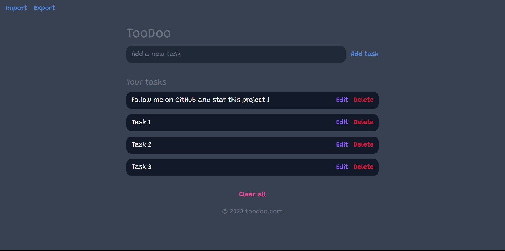

# TooDoo
## Description

TooDoo is a simple todo list app that allows users to create, edit, and delete tasks. The tasks are stored in the local storage of the browser. The user can export the tasks to a JSON file and import tasks from a JSON file. 

The app is built with HTML, CSS, and JavaScript.

The font used is Grandstander by Tyler Finck.

---

## Screenshots

